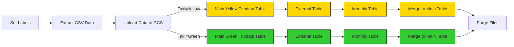

# Workflow Orchestration (with Kestra)

## Introduction to Workflow Orchestration

### What is Workflow Orchestration?
Workflow orchestration is the automated process of managing and coordinating complex data workflows and tasks. It involves scheduling, executing, and monitoring a series of interdependent tasks to ensure that data is processed efficiently and reliably.
In data engineering, workflow orchestration is crucial for automating ETL (Extract, Transform, Load) processes, data pipelines, and other data-related tasks. It helps ensure that data flows smoothly from source to destination while handling dependencies, failures, and retries.

### What is Kestra?
Kestra is an open-source workflow orchestration platform designed to manage and automate complex data workflows.
**Features**
- Build with Flow code (YAML), No-Code, or AI copilot
- 1000+ plugins for various integrations
- Language agnostic
- Full Observability and Monitoring
- Schedule and event-based triggers

## Getting Started with Kestra
### Installing Kestra
We'll use a [Docker Compose file](docker-compose.yml) to set up our Kestra project, which will include:
- 3 volumes (NY Taxi dataset, kestra postgres data, and kestra data)
- 4 services (postgres, pgAdmin, Kestra Postgres, Kestra)

We'll run `docker compose up` to start the services. Once the services are up, we can access the Kestra UI at `http://localhost:8080`, and either make an account or log in with the default credentials.

**Note:** You can add flows via the Kestra API with curl like so:
```bash
curl -X POST -u 'admin@kestra.io:Admin1234' http://localhost:8080/api/v1/flows/import -F fileUpload=@flows/01_hello_world.yaml
```

### Kestra Concepts
- Flow - a container for tasks and their orchestration logic.
  - A flow must have:
    - identifier (id)
    - namespace
    - list of tasks
  - Optionally, a flow can also have:
    - inputs
    - outputs
    - variables
    - triggers
    - labels
    - pluginDefaults
    - errors
    - finally
    - retries
    - sla
    - concurrency
    - descriptions
    - disabled
    - revision
    - checks
- Tasks - the steps within a flow.
  - Runnable Tasks – Perform actual work (API calls, database queries, computations). Executed by workers.
  - Flowable Tasks – Control orchestration (branching, looping, parallelization). Executed by the executor, not suitable for heavy computation.
- Inputs - dynamic values passed to the flow at runtime.
- Outputs - pass data between tasks and flows.
- Triggers - mechanism that automatically starts the execution of a flow.
- Execution - a single run of a flow with a specific state.
- Variables - key–value pairs that let you reuse values across tasks.
- Plugin Defaults - default values applied to every task of a given type within one or more flows.
- Concurrency - control how many executions of a flow can run at the same time.

**Note:** After you save a flow you cannot change the id or namespace. You would need to create a new flow with a different id or namespace. You can change tasks though.

## Creating our first Kestra Data Pipeline
Our pipeline will:
1. Extract data from csv files
2. Create a unique id for each row (Natural Key)
3. Load the data into a Postgres database, avoiding duplicates.

### Step 1: Extract Data from CSV files and prep
* We use Kestra's inputs feature to let us select which color taxi, year, and month we want to process. This way we can reuse the same flow for different datasets.
* We create some tables that we will need (the final table and the staging table).
* Then we use Kestra's command plugin to download and extract the data from the compressed csv files.

### Step 2: Transform (staging)
* We create a staging table (if it doesn't exist) in Postgres and then truncate it to remove any existing data (if it exists).
* Next, we use Kestra's Postgres plugin to copy in the data from the csv file into the staging table.
* Finally we create a unique id for each row in the staging table by hashing its contents, this is called "Natural Key" and will help us with deduplication later.
  * We use the `COALESCE` function to handle null values when creating the hash.

### Step 3: Load into Postgres
* We merge the data from the staging table into the final table, using the unique id we created earlier to avoid duplicates.

### Improvements:
* We can add audit metadata columns to the final table (created_at, updated_at, etc) for deta lineage and tracking.
* Use SHA256 instead of MD5 for better uniqueness.
* Calculate the hash on thhe fly during the merge for performance improvement instead of storing it in the staging table.

If you'd like to remove the files that are downloaded you can add the following task:
```yaml
  - id: purge_files
    type: io.kestra.plugin.core.storage.PurgeCurrentExecutionFiles
    description: This will remove output files. If you'd like to explore Kestra outputs, disable it.
```

## Adding Scheduling

We can schedule our flow to run automatically using `io.kestra.plugin.core.trigger.Schedule` with a cron expression:
```yaml
triggers:
  - id: green_schedule
    type: io.kestra.plugin.core.trigger.Schedule
    cron: "0 9 1 * *"
    inputs:
      taxi: green
```

As a refresher, the cron expression format is:
```
* * * * *
| | | | | | 
| | | | +---- Weekday (0 - 7 or SUN-SAT, 0 and 7 are both Sunday)
| | | +------ Month (1 - 12 or JAN-DEC)
| | +-------- Day of the month (1 - 31)
| +---------- Hour (0 - 23)
+------------ Minute (0 - 59)
```

We can use the "backfill" button to run our flow for past dates as well, but note that the date selected must include when the cron would have triggered.

## ETL vs ELT
**ETL (Extract, Transform, Load)**
- Data is extracted from source systems.
- Data is transformed in an intermediate staging area, preparing it for the final target.
- Transformed data is loaded into the target system

**ELT (Extract, Load, Transform)**
- Data is extracted from source systems.
- Data is loaded directly into the target system (data lake)
- Data is transformed within the target system using its processing capabilities.

**Why ELT?**
- For large datasets, it's often more efficient to load raw data into a data lake and then transform it as needed, since you have the scalability and processing power of the data lake (like Google BigQuery, AWS Redshift, etc).
- ELT allows for more flexibility, as raw data is preserved and can be transformed in multiple ways for different use cases.
- Modern data lakes and warehouses are optimized for handling large-scale transformations, making ELT a more practical approach in many scenarios.

**When to use ETL vs ELT?**
- Choose **ELT** when you already have a cloud warehouse/lakehouse (BigQuery, Snowflake, Redshift, Databricks). Land raw data first, then transform with SQL inside the warehouse. Great for flexibility, easy reprocessing, and serving many teams.
- Choose **ETL** when the destination cannot hold raw data (OLTP DB, legacy system, SaaS app) or you must clean/remove PII before storage. Also use it when you need very low latency and only keep the final shaped data.
- **ELT perks:** simple ingestion, keep raw history, fast backfills, reuse one raw copy for many marts, cheaper ops by using warehouse compute.
- **ETL perks:** tight control before data lands, smaller storage, privacy-by-design, works with targets that can't crunch big transforms.
- **Good ELT signals:** you have a warehouse; transforms are mostly SQL; analysts want raw + curated layers; expect backfills.
- **Good ETL signals:** no warehouse; strict PII rules; heavy non-SQL/ML work needed up front; sub-second SLA with no raw kept.
- **Practical mix:** do a light first pass (basic cleanup, hash/encrypt sensitive fields), store it, then finish transforms in the warehouse.

## ELT Pipelines in Kestra with Google Cloud Platform (GCP)

We will create an ELT pipeline that uses:
1. Google Cloud Storage (GCS) as a data lake
2. BigQuery as a data warehouse.

After having set up a Google Cloud account and project, we need to:
1. Create a service account with BigQuery Admin role and Storage Admin role.
2. Create and download a JSON key for the service account.
3. Base64 encode the JSON key file and store it in a .env file as `SECRET_GCP_CREDS`.
   - Linux:  
     ```bash
     echo -n "SECRET_GCP_CREDS=$(base64 -w 0 path/to/your/gcp-key.json)" > .env
     ```
   - Windows (PowerShell):  
     ```powershell
     $b64 = [Convert]::ToBase64String([System.IO.File]::ReadAllBytes("path\to\your\gcp-key.json"))
     Set-Content -Path .env -Value "SECRET_GCP_CREDS=$b64"
     ```
4. Add the .env file to the Kestra Docker Compose file with `env_file: .env`.
5. Start up Kestra, then verify that the secret is available by going to the "Secrets" tab on the left side of the UI, and scrolling down where it says "Here are secret-type environment variables identified at instance start-time:". You should see `GCP_CREDS` listed there.
6. You can then reference the secret in your Kestra flows as `{{ secret('GCP_CREDS') }}`.

_More details can be found in the [Configure Google Service Account](https://kestra.io/docs/how-to-guides/google-credentials#add-service-account-as-a-secret) docs._

Push the KV flow to Kestra which will help us store info into the kestra KV store (update the flow to use your own GCP project and dataset):
```bash
curl -X POST -u 'admin@kestra.io:Admin1234' http://localhost:8080/api/v1/flows/import -F fileUpload=@flows/06_gcp_kv.yaml
```

Push the GCP setup flow to Kestra which will use the KV store to create our bucket and dataset in BigQuery:
```bash
curl -X POST -u 'admin@kestra.io:Admin1234' http://localhost:8080/api/v1/flows/import -F fileUpload=@flows/07_gcp_setup.yaml
```
Be sure to update the flow to use the secret for your GCP creds by using the `secret('GCP_CREDS')` function.


Now we will create the ELT flow that will:
1. Extract the data from the taxi csv files
2. Load the raw data into GCS
3. Transform and load the data into BigQuery



You can either use the GCP Taxi flow, which is a modified version of the earlier taxi flow but uses GCP services, or use the GCP Taxi Scheduled flow which also includes scheduling to run monthly.

```bash
curl -X POST -u 'admin@kestra.io:Admin1234' http://localhost:8080/api/v1/flows/import -F fileUpload=@flows/08_gcp_taxi.yaml

# OR

curl -X POST -u 'admin@kestra.io:Admin1234' http://localhost:8080/api/v1/flows/import -F fileUpload=@flows/09_gcp_taxi_scheduled.yaml
```