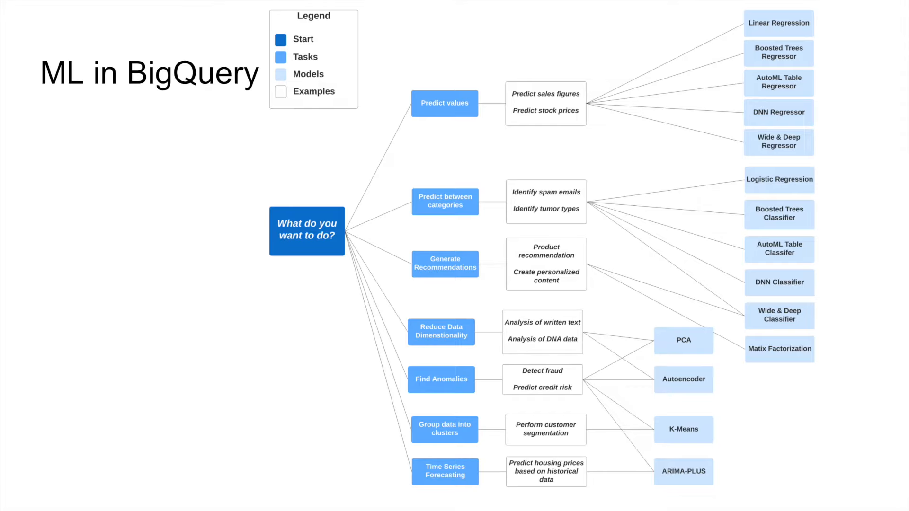

# Data Warehousing and BigQuery

## OLAP vs OLTP

Online Analytical Processing (OLAP) and Online Transaction Processing (OLTP) are two different types of data processing systems used in databases.

|  | OLTP | OLAP |
|---|---|---|
| **Purpose** | Control/run essential business operations in real time | Plan, solve problems, support decisions, discover hidden insights |
| **Data Updates** | Short, fast updates initiated by users | Data periodically refreshed with scheduled, long-running batch jobs |
| **Database Design** | Normalized dbs for efficiency | Denormalized dbs for analysis |
| **Space Requirements** | Small if historical data is archived | Large due to aggregating large datasets |
| **Backup and Recovery** | Regular backups required to ensure business continuity and meet legal/governance requirements | Lost data can be reloaded from OLTP database as needed in lieu of regular backups |
| **Productivity** | Increases productivity of end users | Increases productivity of business managers, data analysts, and executives |
| **Data View** | Lists day-to-day business transactions | Multi-dimensional view of enterprise data |
| **User Examples** | Customer-facing personnel, clerks, online shoppers | Knowledge workers such as data analysts, business analysts, and executives |

## BigQuery Best Practices

**Cost reduction:**
- Avoid `SELECT *` in queries, as it can lead to scanning more data than necessary and increase costs.
  - If you are exploring the data use data preview options.
- Price your queries before running them (select the query and view the estimated cost in the bottom left corner of the query editor)
- Use clustered or partitioned tables
- Use streaming inserts with caution.
- Use materialized views to precompute and store the results of complex queries, which can reduce the amount of data scanned and improve query performance.

**Query performance:**
- Filter on partitioned columns.
- Denormalize data when possible to reduce the number of joins.
  - Use nested or repeated columns if you have complex structures.
- Use external data sources appropriately.
  - Don't use it, in case you want a high query performance, as it can be slower than querying data stored in BigQuery.
- Reduce data before using a JOIN
- Do not treat WITH clauses as prepared statements, as they are not optimized for performance and can lead to slower query execution.
- Avoid oversharding tables, as it can lead to increased query latency and reduced performance. Instead, use partitioning and clustering to optimize query performance.
- Avoid JS user-defined functions (UDFs) when possible, as they can be slower than native SQL functions. If you need to use UDFs, consider using SQL UDFs instead of JavaScript UDFs for better performance.
- Use approximate aggregation functions (HyperLogLog++) when exact counts are not necessary, as they can significantly reduce query execution time while still providing accurate results.
- `ORDER BY` statements should be at the very end of the query.
- Optimize join patterns
- For queries that join data from multiple tables, optimize your join patterns by starting with the largest table.

For more best practices, see the [BigQuery documentation](https://docs.cloud.google.com/bigquery/docs/best-practices-performance-compute).

## External Tables in BigQuery

External tables in BigQuery allow you to query data stored outside of BigQuery, such as in Google Cloud Storage, without having to load it into BigQuery first. This can be useful for analyzing large datasets that are stored in GCS without incurring the cost of loading the data into BigQuery. However, querying external tables can be slower than querying data stored in BigQuery, as it requires reading data from an external source. Therefore, it's important to consider the trade-offs between cost and performance when deciding whether to use external tables in BigQuery.

To create an external table in BigQuery, you can use the following SQL syntax:

```sql
CREATE EXTERNAL TABLE my_dataset.my_external_table
OPTIONS (
  format = 'PARQUET',
  uris = ['gs://my_bucket/path/to/data/*.parquet']
);
```

## Partitioning and Clustering in BigQuery

Partitioning and clustering are two techniques used in BigQuery to optimize query performance and reduce costs when working with large datasets.

Tables with data less than 1 GB don't show significant performance improvements when partitioned or clustered. 
However, for larger datasets, partitioning and clustering can significantly improve query performance by reducing the amount of data that needs to be scanned during queries. 
Partitioning is particularly effective for queries dealing with a range (low-cardinality fields, using `BETWEEN`), while clustering is more effective for queries using filters and aggregations on specific values in the clustering columns (unique/high-cardinality fields).

**Partitioning vs Clustering:**
- Clustering:
  - Cost benefit unknown, but generally more expensive than partitioning.
  - Need more granularity than partitioning.
  - Queries commonly use filters or aggregation against multiple columns.
  - The cardinality of the number of values in a column/group of columns is large (many unique values).
  - **Doesn't cost the user anything**, automatically re-clusters in the background as data is inserted, updated, or deleted.
- Partitioning:
  - Cost known upfront
  - Need partition-level management (e.g., partition expiration, partition pruning)
  - Filter or aggregate on single column (e.g., date, timestamp, integer)

###  Partitioning in BQ

Partitioning is a technique used in BigQuery to divide a large table into smaller, more manageable pieces called partitions. 
This can improve query performance and reduce costs by allowing queries to scan only 
the relevant partitions instead of the entire table.

A common way to partition a table in BigQuery is by using a date or timestamp column. 
This allows you to easily query data for specific time periods, such as hourly, daily, monthly, or yearly partitions. 
You could also partition by an integer range, which is useful for partitioning based on a numeric column, such as an ID or a score.

**NOTE:** *The number of partitions limit is 4,000 per table.*

Common columns used for partitioning include:
- Time-unit column: A column that contains date or timestamp values, such as `timestamp_column`.
- Ingestion-time column: A special column that automatically captures the time when a row is inserted into the table, often used for partitioning based on the time of data ingestion.

To create a partitioned table in BigQuery, you can use the following SQL syntax:

```sql
CREATE TABLE my_dataset.my_partitioned_table
PARTITION BY
    DATE(timestamp_column) AS
SELECT *
FROM my_dataset.my_source_table;
```

To query a partitioned table, you can specify the partition in the WHERE clause of your SQL query. For example, to query data for a specific date range, you can use:

```sql
SELECT *
FROM my_dataset.my_partitioned_table
WHERE DATE(timestamp_column) BETWEEN '2023-01-01' AND '2023-01-31';
```

To analyze and optimize queries on partitioned tables, you can use the `EXPLAIN` statement to see how BigQuery is executing your query and which partitions are being scanned. This can help you identify any performance issues and make adjustments to your partitioning strategy as needed.

You can also use the `INFORMATION_SCHEMA.PARTITIONS` view to get information about the partitions in your table, such as the number of rows and the size of each partition. This can help you monitor the performance of your partitioned tables and make informed decisions about how to manage them.

The following query analyzes the rows in each partition:

```sql
SELECT
    partition_id,
    row_count
FROM
    my_dataset.INFORMATION_SCHEMA.PARTITIONS
WHERE
    table_name = 'my_partitioned_table'
ORDER BY row_count DESC;
```

### Clustering in BQ

Clustering is another technique used in BigQuery to improve query performance (generally the filter and aggregate queries) by organizing data based on the values of one or more columns. 
When a table is clustered, BigQuery sorts the data based on the specified columns, which can help reduce the amount of data scanned during queries.

Columns used for clustering should have a high cardinality (many unique values) to maximize the benefits of clustering. Common columns used for clustering include:
- User ID: A column that contains unique identifiers for users, such as `user_id`.
- Product ID: A column that contains unique identifiers for products, such as `product_id`.
- Geographic Location: A column that contains geographic information, such as `country` or `city`.

The columns you specify are used to colocate related data, which means that rows with similar values in the clustering columns are stored together. 
This can significantly improve query performance, especially for queries that filter on the clustering columns, 
by reducing the amount of data that needs to be scanned.

The clustering columns must be top-level, non-repeated columns, which can be of any data type except for `ARRAY` and `STRUCT`.

To create a clustered table in BigQuery, you can use the following SQL syntax:

```sql
CREATE TABLE my_dataset.my_clustered_table
CLUSTER BY column1, column2 AS
SELECT *
FROM my_dataset.my_source_table;
```

You can also combine partitioning and clustering to further optimize query performance. For example, you can create a partitioned and clustered table like this:

```sql
CREATE TABLE my_dataset.my_partitioned_clustered_table
PARTITION BY
    DATE(timestamp_column)
CLUSTER BY column1, column2 AS
SELECT *
FROM my_dataset.my_source_table;
```

## Machine Learning in BigQuery

BigQuery ML is a feature of BigQuery that allows you to create and execute machine learning models using SQL.

The following diagram can help you decide what algorithm to use based on the type of problem you are trying to solve:


The sql statements for creating and using machine learning models in BigQuery are in the [bq_ml.sql](./bq_ml.sql) file.

To extract and deploy a model follow these steps (taken from the BigQuery [docs](https://cloud.google.com/bigquery-ml/docs/export-model-tutorial))

1. **Authenticate to Google Cloud**
   ```bash
   gcloud auth login
   ```

2. **Extract the model to Google Cloud Storage**
   Export the model `nytaxi.tip_model` to a GCS bucket.
   ```bash
   bq --project_id taxi-rides-ny extract -m nytaxi.tip_model gs://taxi_ml_model/tip_model
   ```

3. **Download the model locally**
   Create a temporary directory and copy the model files from GCS.
   ```bash
   mkdir /tmp/model
   gsutil cp -r gs://taxi_ml_model/tip_model /tmp/model
   ```

4. **Prepare the model for serving**
   Create the directory structure required by TensorFlow Serving (requires a version number, e.g., `1`) and copy the model files.
   ```bash
   mkdir -p serving_dir/tip_model/1
   cp -r /tmp/model/tip_model/* serving_dir/tip_model/1
   ```

5. **Run TensorFlow Serving with Docker**
   Pull the image and run the container, mounting the local model directory to the container's model path.
   ```bash
   docker pull tensorflow/serving
   docker run -p 8501:8501 \
     --mount type=bind,source=`pwd`/serving_dir/tip_model,target=/models/tip_model \
     -e MODEL_NAME=tip_model \
     -t tensorflow/serving &
   ```

6. **Make a prediction**
   Send a POST request to the running service with sample data.
   ```bash
   curl -d '{"instances": [{"passenger_count":1, "trip_distance":12.2, "PULocationID":"193", "DOLocationID":"264", "payment_type":"2","fare_amount":20.4,"tolls_amount":0.0}]}' \
     -X POST http://localhost:8501/v1/models/tip_model:predict
   ```

7. **Verify model status**
   Check the model metadata.
   ```bash
   http://localhost:8501/v1/models/tip_model
   ```