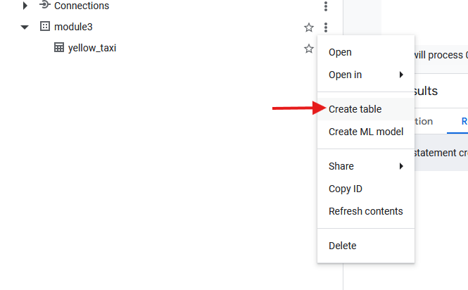
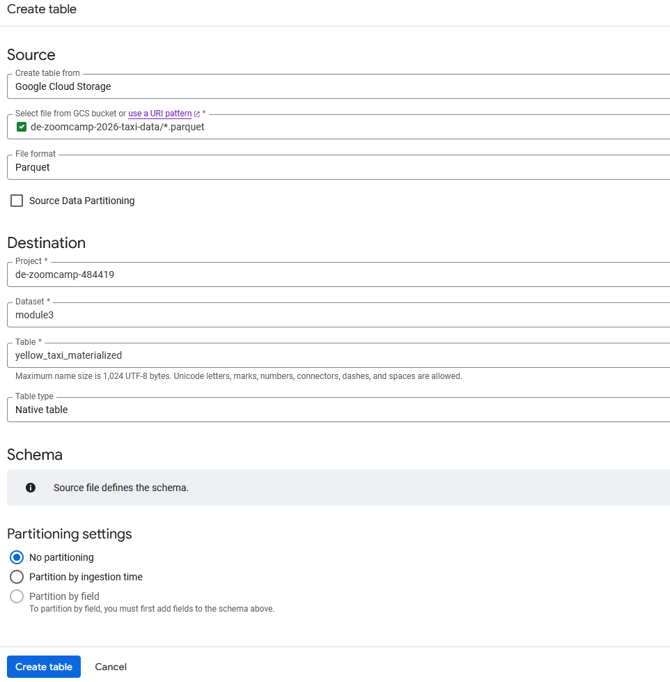
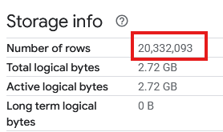

# Module 3 Homework: Data Warehousing & BigQuery

In this homework we'll practice working with BigQuery and Google Cloud Storage.

When submitting your homework, you will also need to include
a link to your GitHub repository or other public code-hosting
site.

This repository should contain the code for solving the homework.

When your solution has SQL or shell commands and not code
(e.g. python files) file format, include them directly in
the README file of your repository.

## Data

For this homework we will be using the Yellow Taxi Trip Records for January 2024 - June 2024 (not the entire year of data).

Parquet Files are available from the New York City Taxi Data found here:

https://www.nyc.gov/site/tlc/about/tlc-trip-record-data.page

## Loading the data

You can use the following scripts to load the data into your GCS bucket:

- Python script: [load_yellow_taxi_data.py](./load_yellow_taxi_data.py)
- Jupyter notebook with DLT: [DLT_upload_to_GCP.ipynb](./DLT_upload_to_GCP.ipynb)

You will need to generate a Service Account with GCS Admin privileges or be authenticated with the Google SDK, and update the bucket name in the script.

If you are using orchestration tools such as Kestra, Mage, Airflow, or Prefect, do not load the data into BigQuery using the orchestrator.

Make sure that all 6 files show in your GCS bucket before beginning.

Note: You will need to use the PARQUET option when creating an external table.


## BigQuery Setup

Create an external table using the Yellow Taxi Trip Records.

```SQL
CREATE OR REPLACE EXTERNAL TABLE module3.yellow_taxi_external
OPTIONS (
  format = 'PARQUET',
  uris = ['gs://de-zoomcamp-2026-taxi-data/*.parquet']
);

```

Create a (regular/materialized) table in BQ using the Yellow Taxi Trip Records (do not partition or cluster this table). 





Or through code:

```SQL
CREATE OR REPLACE TABLE module3.yellow_taxi AS
SELECT * FROM module3.yellow_taxi_external;
```

---

## Question 1. Counting records

What is count of records for the 2024 Yellow Taxi Data?



**Answer:** 20,332,093

---

## Question 2. Data read estimation

Write a query to count the distinct number of PULocationIDs for the entire dataset on both the tables.
 
What is the **estimated amount** of data that will be read when this query is executed on the External Table and the Table?

```SQL
SELECT COUNT(DISTINCT(PULocationID)) FROM `module3.yellow_taxi`; -- External table

SELECT COUNT(DISTINCT(PULocationID)) FROM `module3.yellow_taxi_reg`;
```

**Answer:** 0 MB for the External Table and 155.12 MB for the Materialized Table

---

## Question 3. Understanding columnar storage

Write a query to retrieve the PULocationID from the table (not the external table) in BigQuery. Now write a query to retrieve the PULocationID and DOLocationID on the same table.

```SQL
SELECT PULocationID FROM `module3.yellow_taxi_reg`;

SELECT PULocationID, DOLocationID FROM `module3.yellow_taxi_reg`;
```

Why are the estimated number of Bytes different?

**Answer:** BigQuery is a columnar database, and it only scans the specific columns requested in the query. Querying two columns (PULocationID, DOLocationID) requires reading more data than querying one column (PULocationID), leading to a higher estimated number of bytes processed.

---

## Question 4. Counting zero fare trips

How many records have a fare_amount of 0?

```SQL
SELECT COUNT(*) FROM `module3.yellow_taxi_reg` WHERE fare_amount = 0;
```

**Answer:** 8,333

---

## Question 5. Partitioning and clustering

What is the best strategy to make an optimized table in Big Query if your query will always filter based on tpep_dropoff_datetime and order the results by VendorID (Create a new table with this strategy)

```SQL
CREATE TABLE `module3.yellow_taxi_partitioned_clustered`
PARTITION BY
  DATE(tpep_dropoff_datetime)
CLUSTER BY
  VendorID
AS
  SELECT * FROM `module3.yellow_taxi_reg`;
```

**Answer:** Partition by tpep_dropoff_datetime and Cluster on VendorID

---

## Question 6. Partition benefits

Write a query to retrieve the distinct VendorIDs between tpep_dropoff_datetime
2024-03-01 and 2024-03-15 (inclusive)

```SQL
SELECT DISTINCT(VendorID)
FROM `module3.yellow_taxi_reg`
WHERE DATE(tpep_dropoff_datetime) BETWEEN '2024-03-01' AND '2024-03-15';

SELECT DISTINCT(VendorID)
FROM `module3.yellow_taxi_partitioned_clustered`
WHERE DATE(tpep_dropoff_datetime) BETWEEN '2024-03-01' AND '2024-03-15';
```

Use the materialized table you created earlier in your from clause and note the estimated bytes. Now change the table in the from clause to the partitioned table you created for question 5 and note the estimated bytes processed. What are these values? 

**Answer:** 310.24 MB for non-partitioned table and 26.84 MB for the partitioned table

---

## Question 7. External table storage

Where is the data stored in the External Table you created?

**Answer:** GCP Bucket

---

## Question 8. Clustering best practices

It is best practice in Big Query to always cluster your data:

**Answer:** False (Not if your data is small and you don't have a specific query pattern that benefits from clustering)

---

## Question 9. Understanding table scans

No Points: Write a `SELECT count(*)` query FROM the materialized table you created. How many bytes does it estimate will be read? Why?

**Answer:** 0 B because BigQuery uses metadata to get the count of records without scanning the actual data.

## Learning in Public

We encourage everyone to share what they learned. This is called "learning in public".

Read more about the benefits [here](https://alexeyondata.substack.com/p/benefits-of-learning-in-public-and).

### Example post for LinkedIn

```
🚀 Week 3 of Data Engineering Zoomcamp by @DataTalksClub complete!

Just finished Module 3 - Data Warehousing with BigQuery. Learned how to:

✅ Create external tables from GCS bucket data
✅ Build materialized tables in BigQuery
✅ Partition and cluster tables for performance
✅ Understand columnar storage and query optimization
✅ Analyze NYC taxi data at scale

Working with 20M+ records and learning how partitioning reduces query costs!

Here's my homework solution: <LINK>

Following along with this amazing free course - who else is learning data engineering?

You can sign up here: https://github.com/DataTalksClub/data-engineering-zoomcamp/
```

### Example post for Twitter/X

```
📊 Module 3 of Data Engineering Zoomcamp done!

- BigQuery & GCS
- External vs materialized tables
- Partitioning & clustering
- Query optimization

My solution: <LINK>

Free course by @DataTalksClub: https://github.com/DataTalksClub/data-engineering-zoomcamp/
```