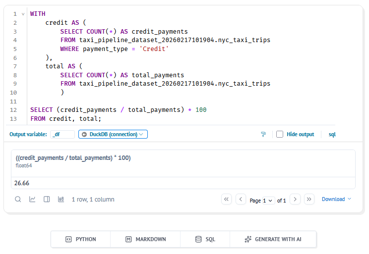
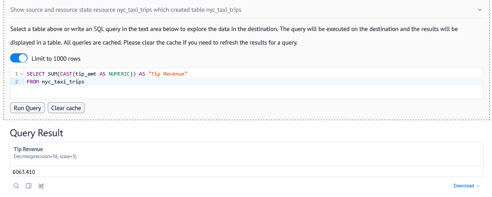

# Homework: Build Your Own dlt Pipeline

## Questions

Once your pipeline has run successfully, use the methods covered in the workshop to investigate the following:

- **dlt Dashboard**: `dlt pipeline taxi_pipeline show`
- **dlt MCP Server**: Ask the agent questions about your pipeline
- **Marimo Notebook**: Build visualizations and run queries

We challenge you to try out the different methods explored in the workshop when answering these questions to see what works best for you. Feel free to share your thoughts on what worked (or didn't) in your submission!

### Question 1: What is the start date and end date of the dataset?
```text
Prompt: What is the start date and end date of the dataset?
```

**Answer:** 2009-06-01 to 2009-07-01

---

### Question 2: What proportion of trips are paid with credit card?
```text
Prompt: Create a simple marimo notebook that I can use to query the dataset.
```

> The agent created the notebook and I opened it with `marimo edit marimo_query_notebo  ok.py`
> The SQL input cell created by the agent didn't work,
> so I added a native SQL cell manually and set connection to the duckdb database.

```sql
WITH
	credit AS (
		SELECT COUNT(*) AS credit_payments
		FROM taxi_pipeline_dataset_20260217101904.nyc_taxi_trips
		WHERE payment_type = 'Credit'
	),
	total AS (
		SELECT COUNT(*) AS total_payments
		FROM taxi_pipeline_dataset_20260217101904.nyc_taxi_trips
		)

SELECT (credit_payments / total_payments) * 100
FROM credit, total;
```



**Answer:** 26.66%

---

### Question 3: What is the total amount of money generated in tips?

> For this question I decided to use the Dataset Browser in the dlt Dashboard,
> which allows me to run SQL queries on the data without needing to set up a notebook.

```sql
WITH totals AS (
  SELECT
    SUM(CAST(total_amt AS NUMERIC)) AS total_sum,
    SUM(CAST(tip_amt AS NUMERIC)) AS tip_sum
  FROM "nyc_taxi_trips"
)

SELECT (total_sum + tip_sum) AS "Total Revenue" 
FROM totals;
```



**Answer:** $6,063.41
